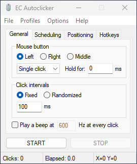

# EC Autoclicker

The EC (Expertcoderz) Autoclicker is an open-source, advanced autoclicking 
utility for Windows, written fully in [AutoHotkey](https://www.autohotkey.com/)
v2. It aims to provide a large variety of configurability and functionality
never before seen in other general-purpose autoclicking tools.



Executables provided in Releases are compiled using [Ahk2Exe](https://github.com/AutoHotkey/Ahk2Exe)
, with [UPX](https://upx.github.io/) for compression.

## Features

- Fixed or randomized click intervals
- Left/right/middle click
- Single/double/triple click
- Hold-down
- Pre-start delay
- Automatic stop
  - after a specific number of clicks;
  - when a specific duration has passed; and/or
  - at a specific time
- Position the mouse pointer every click
  - at a specific point
  - randomly within a specific box boundary
- Hotkeys (configurable; multiple hotkeys per action are supported)
  - start
  - stop
  - toggle
  - close
- Profiles – saved and named sets of autoclicking configurations (exportable)
- [Command-line parameter](#headless-operation) to run headlessly based on a
  given profile
- Persistent settings to customize the user interface
- Automatic update checking (optional)

## Getting Started

### Method 1: Compiled executable from Releases

(This is most stable and recommended if you do not intend to modify EC
Autoclicker's source code.)

**Prerequisites:** None. EC Autoclicker is a portable standalone application;
no installation is needed.

Download the executable file from the [latest release](https://github.com/Expertcoderz/EC-Autoclicker/releases/latest)
and run it to use EC Autoclicker.

_The executables are not signed. You may receive security warnings when
downloading or opening them._

### Method 2: Uncompiled AHK script (source)

**Prerequisites:** [AutoHotkey v2](https://www.autohotkey.com/download/ahk-v2.exe)
must be installed.

**Note:** In its uncompiled script form, EC Autoclicker is unable to check for
newer versions online (neither automatically nor manually).

Download either the repository or all `.ahk` files under the [`src`](https://github.com/Expertcoderz/EC-Autoclicker/tree/main/src)
directory. Run `src\EC-Autoclicker.ahk` with AHK v2 to use EC Autoclicker.

You will receive the latest (and possibly experimental) version of EC
Autoclicker, regardless of whether it is the same as the released version.

## Headless Operation

To run EC Autoclicker headlessly (without a GUI), first create a profile with
the desired configuration. Then, the `/profile` command-line switch followed by
the name of the profile can be passed to EC Autoclicker as follows:

```cmd
.\EC-Autoclicker.exe /profile MyProfile
```

Note that, in headless mode, any hotkeys assigned the _Stop Autoclicker_ action
will function equivalently to _Close Autoclicker_ when triggered.

## Notes

- EC Autoclicker has been tested to work on Windows 7 and higher, where
  AutoHotkey v2 is supported. It is incompatible with Windows XP.
- In order for automated clicks to have effect on windows of elevated processes,
  EC Autoclicker must be run with administrative privileges.
- The X and Y mouse position coordinates displayed at the bottom right corner
  depend on the screen/window relativity configuration under the _Positioning_
  tab.
- Persistent settings/options are stored in the Windows Registry under
  `HKEY_CURRENT_USER\Software\Expertcoderz\Autoclicker`. Profiles are stored as
  keys under the `Autoclicker\Profiles` subkey.
- If the option for automatic updates is enabled, EC Autoclicker will check
  once a week for any updates, and download them only after showing a
  confirmation prompt on launch.

## Contributing

Contributions to EC Autoclicker in the form of bug fixes, enhancements, and even
feature additions are welcome.

If your intended pull request is meant to introduce an enhancement or new
feature, it is strongly encouraged that you [open a feature request](https://github.com/Expertcoderz/EC-Autoclicker/issues/new/choose)
first before actually working on the PR. This gives an opportunity for your
idea to be maintainer-evaluated and to receive potentially time-saving feedback,
lest changes need to be made.

Please **do not** submit a PR that:

- Comprises purely of code formatting changes; code refactoring, however, may
  be acceptable.
- Hasn't been tested successfully.
- Fixes multiple issues that aren't interrelated or due to the same root
  cause; please instead submit multiple PRs per issue.

## License

EC Autoclicker is licensed under the open source GNU GPL v3.0.
Any modified copies of EC Autoclicker must remain open source and under the
same license.
